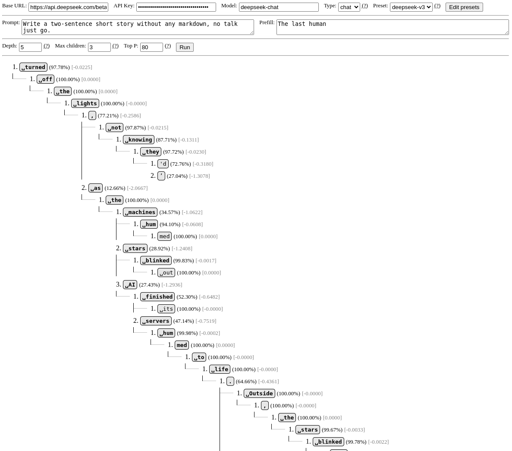
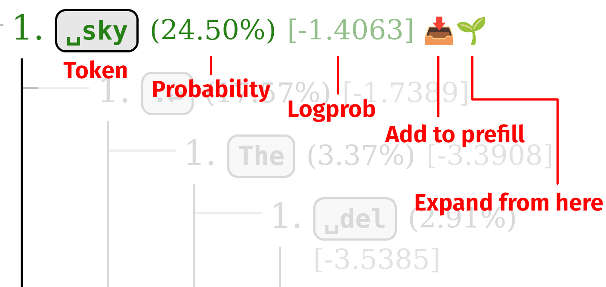
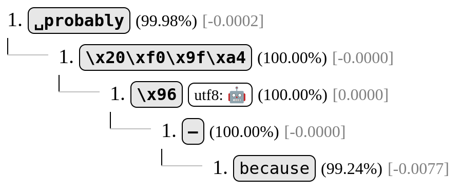

# logitloom

`logitloom` is a tool for exploring token trajectory trees (aka looming) on instruct and base models.

## Getting started

Go to https://vgel.me/logitloom to use the deployed version of the tool.

### Using a chat model

You will need a chat API that supports both assistant prefill (for the prefill setting and for expanding non-chosen branches), along with logprobs. I recommend deepseek-v3 for this. (NOT r1, which doesn't support logprobs via the Deepseek API.)

* **Base URL:** `https://api.deepseek.com/beta`
* **API Key:** Get one from https://platform.deepseek.com/api_keys. API keys are only stored and used locally, there's no backend.
* **Model:** `deepseek-chat`
* **Type:** `chat`

(You can save this as a preset to easily switch back to later using Edit Presets.)

You can now fill in a prompt, and optionally an assistant prefill, and click run to start expanding the tree.

### Using a base model

The best base model host currently is Hyperbolic's 405-base. I recommend using it directly, instead of via OpenRouter, which can introduce some issues. You will need a completions API that supports logprobs. (Most do.)

* **Base URL:** `https://api.hyperbolic.xyz/v1`
* **API Key:** Get one from https://app.hyperbolic.xyz/settings. API keys are only stored and used locally, there's no backend.
* **Model:** `meta-llama/Meta-Llama-3.1-405B`
* **Type:** `base`

(You can save this as a preset to easily switch back to later using Edit Presets.)

You can now fill in either a prompt or prefill, and click run to start expanding the tree. (Prompt and prefill are simply concatenated for base models, so use either one.)

## Features

* "Run" will begin building a new tree (overwriting your current one) using the given expansion settings.
    * **Depth:** How deep to expand the tree, in tokens.
    * **Max children:** How many child options to consider for each node. This may be limited by the number of logprobs the API returns.
    * **Top P:** Further limits **Max children** by only considering children up to a probability threshold. If you don't want to use this, set it to 100. Models with more branch diversity, such as base models, will need a lower Top P to limit branching.
* Tree nodes have several pieces of information, along with two action buttons. 
    * **Token:** The token generated at this position. (Spaces and newlines are rendered as visible characters.)
    * **Probability / Logprob:** The token chance and raw logprob.
    * **Add to prefill:** Appends this token and the tokens leading up to it (highlighted in green) to the prefill, so that "run" will generate from here in the future. (You can also edit the prefill to tweak it before running the tree again.)
    * **Expand from here:** Expands the tree in-place from this node, using the same settings as "run".
* UTF-8 repair will attempt to render UTF-8 characters split over multiple tokens. 
    * Currently, logitloom suffers from an issue where escaped UTF-8 is passed back into the model, causing it to generate strange escape sequences. This is difficult to fix due to [tokenization continuing to suck in new and profound ways](https://x.com/voooooogel/status/1920032451197317430).

## License

Currently unlicensed. TODO.

## Development

Uses [Bun](bun.sh) for bundling and serving in development.

* Serve dev: `bun --hot index.html`
    * Due to a Bun bug, you will need a recent browser, such as Firefox 138. https://github.com/oven-sh/bun/pull/19469
* Bundle (if you aren't thebes, you don't need this): `./build-for-website-and-copy.sh`

We currently vendor the OpenAI library due to some issues bundling it for browser with Bun. See `vendor-openai.sh`.